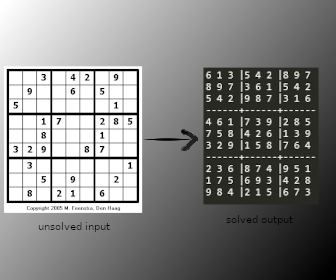

## SUDOKU SOLVER

#### - How does it work?
1. It takes unsolved sudoku images as input and crops out each sudoku cell with the help of *OpenCV*.
2. Then each cell is parsed and passed through [CNN(Convolutional Neural Network)](https://en.wikipedia.org/wiki/Convolutional_neural_network) to get the prediction.
3. The prediction is then passed to the *[solver](http://norvig.com/sudoku.html "very good solver")* ,which solves the sudoku.

#### - How to use?
- Add your unsolved sudoku image named as *sudoku.jpg*(replace the present one).
- Run *main.py* file located in *Source* folder, that's it.

#### - Here's one example.

***

***

##### - References:
- *[solver](http://norvig.com/sudoku.html "very good sudoku solver")*
